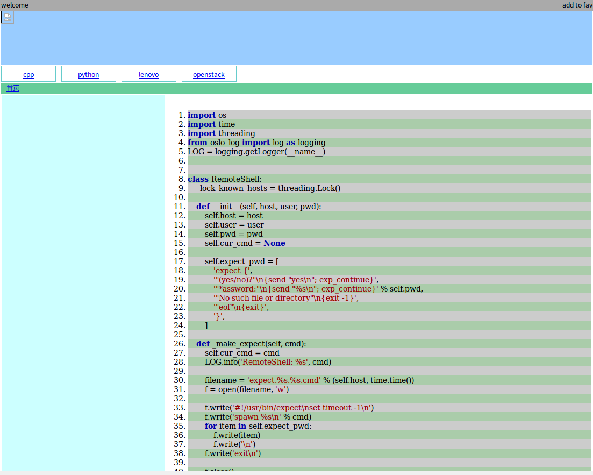

# PyHtmlEx
A python lib to generate variable html elements.
#### Examples:
```
cd pyhtmlex/demo
python main.py
```
Then, a html file will be generated under directory "pyhtmlex/demo", just open it with your browser!
- You can just open "pyhtmlex/demo/code.html" to see result as well.

* * *
You can also use this lib with Django, the member function "generate" will "yield" the html content:
```
from base.root import Html
from pyhtmlex.utils import lazy_head
from wiki.wiki.body import body_factory
from django.http import StreamingHttpResponse

def body_main(content):
    body, style, left, right = body_factory([("/", "首页")])

    right.push_back(content)

    style.append(content.style)
    return body, style

def main(request):
    body, styles = body_main()
    head = lazy_head("my PyHtmlEx", styles)
    return StreamingHttpResponse(Html(head, body).generate())

```

#### How to Start a Personal Wiki(A project based on PyHtmlEx):

```
# pip install Django==1.11.3
# git clone https://github.com/alswell/PyHtmlEx.git
# cd pyhtmlex/demo
# cp -r wiki ~/
# cd ~/wiki
# python manager.py runserver 0.0.0.0:<prot>

Open browser and visit http://<server-ip>:<port>
```
You can just put you txt file under "./static/blog/", and directory is supported as well!
